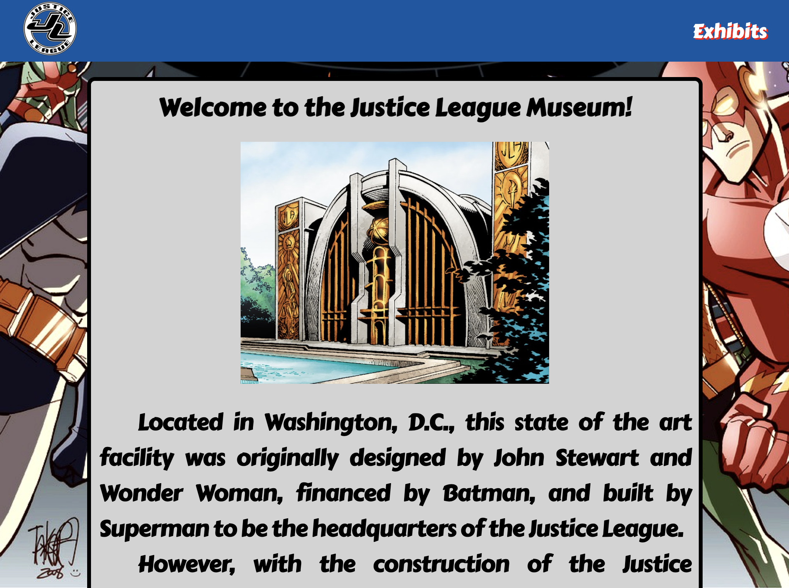
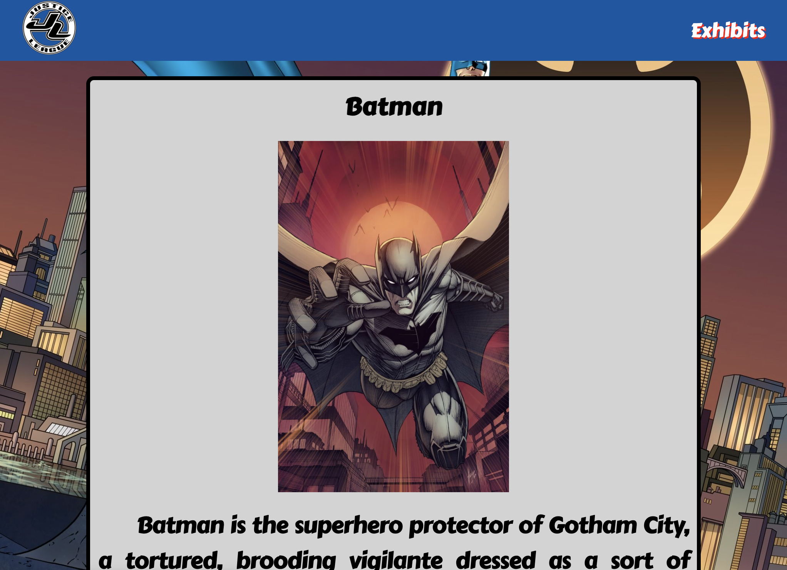

# justice-league

This application is a fictional interpretion of what a Justice Leauge Museum might look like. It was created using React.

## Disclaimer

This is a work of fiction.

## How to use

[Deployed Website](https://justiceleague-app.herokuapp.com/)

Or clone the repo and run `npm install` then `npm start`.

## To do

Create Sagans for the remaining 4 superheros.

## Screenshots

